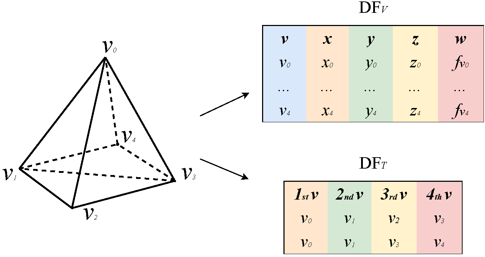

# Tetra-Spark framework

## Introduction
Tetrahedral meshes are widely used due to their flexibility and adaptability in representing complex geometries and topology changes. However, most existing data structures struggle to efficiently encode the irregular topology (connectivity) of tetrahedral meshes with billions of vertices due to the demanding memory requirement, often preventing further analysis.

We address this problem by proposing a novel framework for efficient and scalable analysis of large tetrahedral meshes using Apache Spark. The proposed framework, called Tetra-Spark, is based on a novel data structure for encoding the minimal information of a tetrahedral mesh, and integrates efficient algorithms for the computation of the morphology. To prove the effectiveness and scalability of such a framework, we conduct a comprehensive comparison against a vanilla Spark implementation for the analysis of tetrahedral meshes.

## Mesh encoding
Tetra-Spark encodes two DataFrames, called $DF_V$ and $DF_T$.




## Connectivity relations extraction
Tetra-Spark supports two strategies for extracting connectivity relations: *global* methods and *local* methods. Global methods work on an entire DataFrame by using native operations provided in Spark. *Local methods* offer a more efficient approach by applying *user-defined functions (UDFs)* to a DataFrame.

+ Boundary relation
  * TV relation
  * TE relation
  * TF relation
  * FV relation
  * FE relation
  * EV relation
+ Coboundary relation
  * VT relation
  * VF relation
  * VE relation
  * ET relation
  * EF relation
  * FT relation
+ Adjacent relation
  * VV relation
  * TT relation
 
## Topological features computation
To quantify the improvements offered by our optimized approach in retrieving relations for practical applications, we have implemented three algorithms in both Tetra-Spark and Vanilla-Spark.
+ Discrete vertex distortion
  - An algorithm requiring only coboundary relations involving vertices (VT and VF).
+ Critical points
  - An example involving both boundary and coboundary relations involving vertices (VT, VF, VV, and TE).
+ Forman gradient
  - A more demanding example with both boundary and coboundary relations (VT, VF, VE, EF, FT).

### Supported File Formats ###

Tetra-Spark supports files in `.ts` format, which are simple ASCII files containing the explicit representation of vertices and tetrahedra
```
nV mT              -  number of vertices (nV) and tetrahedra (mT)
x1 y1 z1 f1        -  x y z coordinates for each vertex and its field value
x2 y2 z2 f2
.  .  .  .
xn yn zn fn

v11 v21 v31 v41    -  vertices (v1 v2 v3 v4) of the first tetrahedron
v12 v22 v32 v42
.   .   .   .
v1m v2m v3m v4m

